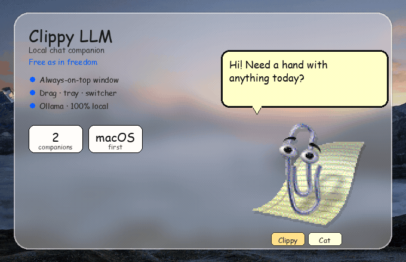
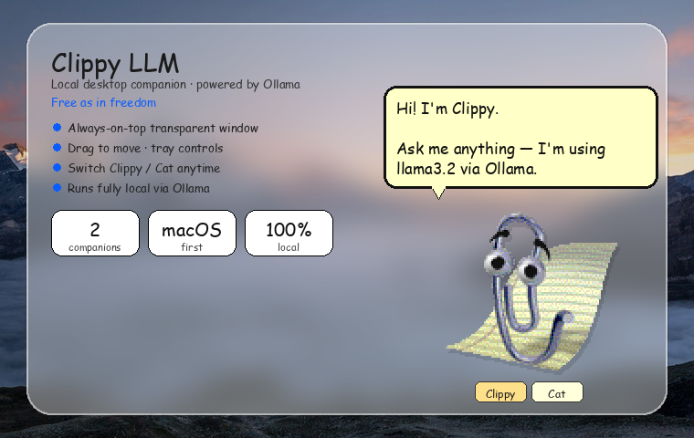
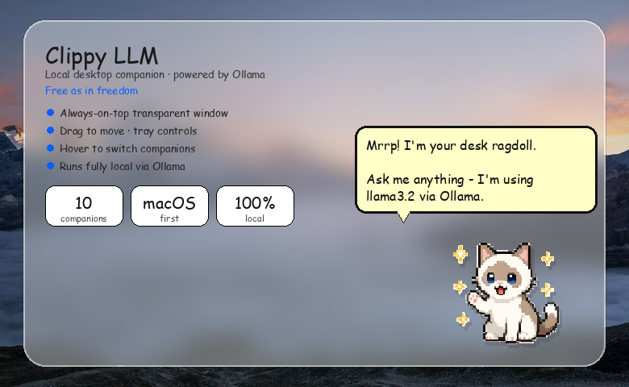
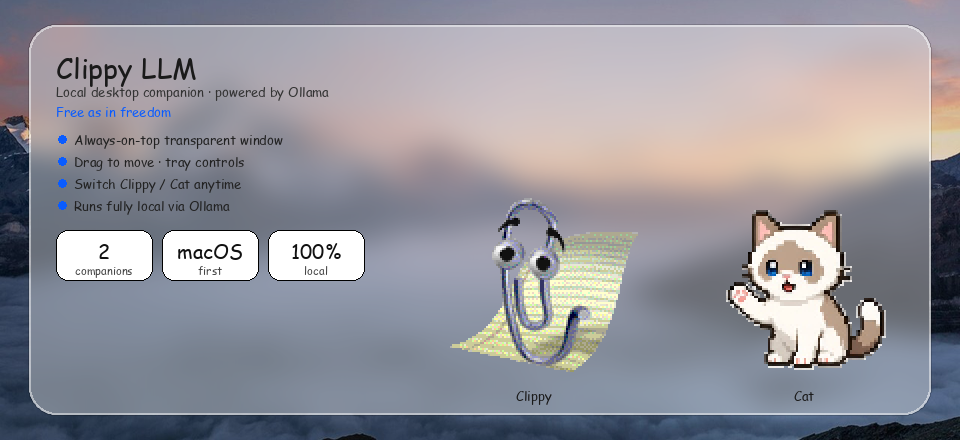

# Clippy LLM

<p align="center">
 
</p>

<p align="center">
 <strong>A Mac-first desktop companion</strong> that chats with a local LLM via <a href="https://ollama.com">Ollama</a>.<br/>
 Always-on-top, transparent window · drag to move · tray controls · classic Office Assistants + Cat.<br/>
 <em>Free as in freedom</em> - local models, open stack, yours to run and tweak.
</p>

<p align="center">
 
 
 
 
 
 
</p>

## What it looks like

| Clippy | Cat |
|:---:|:---:|
|  |  |

<p align="center">
 
</p>

## Stack

| Layer | Tech | Role |
|-------|------|------|
| Shell | **Tauri 2** + Rust | Transparent always-on-top window, menu-bar tray, config |
| UI | **TypeScript** + **Vite** | Speech bubble chat + sprite animations |
| Model | **Ollama** | Local chat API (`http://127.0.0.1:11434`) |

## Prerequisites

- macOS
- [Node.js](https://nodejs.org) 20+
- [Rust](https://rustup.rs) (stable)
- [Ollama](https://ollama.com) installed and running
- Xcode Command Line Tools (`xcode-select --install`)

## Setup

```bash
# Install JS deps
npm install

# Pull a model (once)
ollama pull llama3.2
```

## Run

```bash
# Dev (recommended while iterating)
./clippy
# or
npm run clippy

# With CLI flags (./clippy handles the Tauri/cargo `--` separators)
./clippy --model llama3.2 --ollama http://127.0.0.1:11434

# Raw tauri form needs two `--` groups: runner args, then app args
npm run tauri -- dev -- -- --model llama3.2

# Built binary (flags go straight to Clippy)
./src-tauri/target/debug/clippy --model llama3.2
npm run clippy:build
open src-tauri/target/release/bundle/macos/Clippy.app
```

| Flag | Default | Description |
|------|---------|-------------|
| `--model` | `llama3.2` | Ollama model name |
| `--ollama` | `http://127.0.0.1:11434` | Ollama base URL |

### Config file

On first launch, Clippy writes `~/.config/clippy-llm/config.toml`:

```toml
model = "llama3.2"
ollama_url = "http://127.0.0.1:11434"
proactive = true
companion = "Clippy" # Merlin, Links, Rover, Genius, Genie, Peedy, Rocky, F1, Cat
# system_prompt = "..."
```

CLI flags override the config file.

## Usage

- Click the companion to open the speech bubble and chat
- Drag the character to reposition the window
- Hover the character to open the companion picker below (two rows)
- Menu-bar tray: Hide/Show, Mute proactive tips, Quit
- Closing the window hides Clippy; quit from the tray

## Companions

Hover the character - companion options appear in two rows below.

| Companion | Assets | Notes |
|-----------|--------|-------|
| **Clippy** | `public/agents/Clippy` | Classic paperclip (clippy.js) |
| **Merlin** | `public/agents/Merlin` | Wizard |
| **Links** | `public/agents/Links` | Original Office Assistant cat |
| **Rover** | `public/agents/Rover` | Dog |
| **Genius** | `public/agents/Genius` | Einstein-style professor |
| **Genie** | `public/agents/Genie` | Lamp genie |
| **Peedy** | `public/agents/Peedy` | Parrot |
| **Rocky** | `public/agents/Rocky` | Rock |
| **F1** | `public/agents/F1` | Robot |
| **Cat** | `public/agents/Cat` | Original white ragdoll pixel art for this project |

## Project layout

```
src/ # frontend (sprite stage, bubble, Ollama client)
src-tauri/ # Rust shell (window, tray, CLI, config)
public/agents/ # Clippy, Merlin, Links, Rover, Genius, Genie, Peedy, Rocky, F1, Cat
media/ # README promo images + demo GIF
scripts/clippy.js # npm bin helper
```

## License note

Classic Office Assistant sprite assets (Clippy, Merlin, Links, Rover, Genius, Genie, Peedy, Rocky, F1) originate from the recreation used by [clippy.js](https://github.com/smore-inc/clippy.js). Microsoft trademarks belong to their respective owners; this project is an unofficial fan companion for personal use.

The Cat companion (white ragdoll, pixel art) is original artwork generated for this project and may be used freely with the app.

Promo backgrounds use a free mountain landscape from [Unsplash](https://unsplash.com/license) (`media/wallpaper.jpg`; see `media/ATTRIBUTION.md`).
